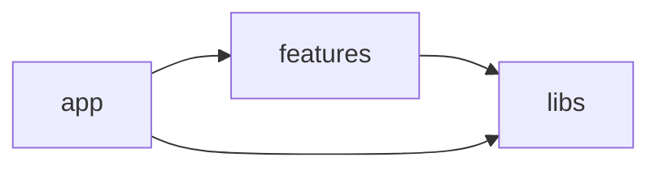

# Feature Garden Core

Feature Garden is an opinionated, tree-based, modular architecture for front-end applications.

- [Goal](#goal)
- [Terminology](#terminology)
- [Core Idea](#core-idea)
- [Rules](#rules)

## Goal

The goal of Feature Garden is to help manage the application's structural complexity.

## Terminology

- **Architectural module** — an independent structural unit of the system that encapsulates functionality behind a public interface
- **Module** - an architectural module implemented as a single file
- **Feature** - an architectural module implemented as a folder that organizes other architectural modules.
- **Library** - a collection of modules grouped around a single responsibility. A library may or may not be an architectural module.
- **External library** - package installed via a package manager like npm.

## Core Idea
The application consists of 3 layers:

- Libraries
- Features
- App

### Libraries
Libraries provide low-level building blocks and serve as the primary mechanism for code reuse.
They can also encapsulate implementation details, such as external libraries, and hide them from the rest of the application.

### Features
Features are the main mechanism for managing structural complexity.
They compose library modules into cohesive architectural modules.
Root-level features typically represent user-facing capabilities.
Modules inside a feature are private by default and become public only through the feature’s public entry point (index.ts).
Features can be nested, forming a tree structure that helps manage complexity.

The features layer is represented by two folders: `features` and `shared-features`.
Features from `features` can only be imported by their parent feature or by the app layer if they are root features.
Shared features are an exception and can be imported by any feature.

Shared features are not the primary mechanism for structuring an application. 
They represent a deliberate trade-off, used only when avoiding duplication (DRY) is more important than preserving strict architectural isolation.

### App
The App layer is responsible for composing features into the final application.
Composition should follow the framework’s conventions and mechanisms.
Routing is implemented in the App layer according to the chosen framework.
The App layer may also use libraries when needed.

## Rules
- Module dependencies must form a directed acyclic graph (no circular dependencies)
- Layers must follow the dependency rules shown below

- Modules inside a feature cannot import from the parent feature
- Modules inside a feature cannot import private modules from nested features
- All rules must be enforced by tooling (ESLint or equivalent)
