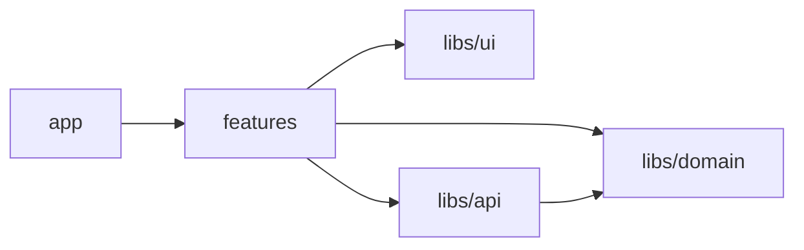

# Feature Garden Core

> This doc is in progress

Feature Garden is an opinionated, tree-based, modular architecture for front-end applications.

- [Goal](#goal)
- [Terminology](#terminology)
- [Core Idea](#core-idea)

## Goal

The goal of Feature Garden is to help manage the application's structural complexity.

## Terminology

- **Architectural module** — a structural unit of the system that encapsulates functionality behind a public interface
- **Module** - an architectural module implemented as a single file
- **Feature** - an architectural module implemented as a folder that contains other architectural modules and usually represents a user-facing capability
- **Library** - a collection of modules grouped around a single responsibility. A library may or may not define an architectural module depending on whether it exposes a clear public interface and keeps some modules internal.

## Core Idea
Module dependencies should form a directed acyclic graph (no circular dependencies).

The app has 3 layers:

- **libs** — low-level building blocks of the application.  
  Typically includes:
  - **UI library** (`Button`, `Input`, `ConfirmModal`)
  - **API library** (`useTasks`, `createTask`, `startTask`)
  - **Domain library** (`calculateDuration`, `validateInterval`)

- **features** — modules represented as folders that contain other modules.
  Features can be nested, forming a tree-like structure.
  (`tasks`, `active-task`, `time-intervals`).

- **app** — composes features into the final application and implements routing according to the chosen framework.

These layers follow the import rules shown below:

