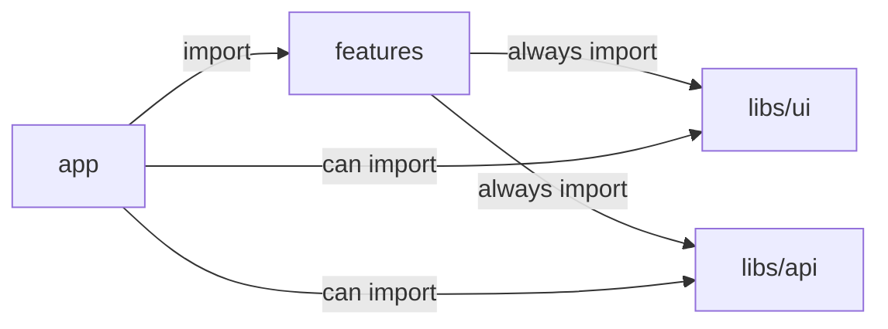

# Feature Garden Front-End Architecture

> This document is not quite ready

Feature Garden is an opinionated feature-based architecture for component-based front-end applications.

- [Problem](#problem)
- [Solution](#solution)
- [When to use Feature Garden](#when-to-use-feature-garden)
- [When not to use Feature Garden](#when-not-to-use-feature-garden)
- [Core Idea](#core-idea)
- [API Library](#api-library)
- [UI Library](#ui-library)

## Problem

One of the main problems in modern application development is controlling complexity as applications grow.
Existing approaches often optimize either for early development speed or for large-scale, but struggle to provide a clear growth path from zero to complexity.
Large-scale solutions often sacrifice simplicity (KISS) and pragmatism (YAGNI) in favor of strict rules and structure. A feature-based approach is a good starting point, but it does not enforce architectural boundaries and leaves many important questions unanswered.

## Solution
Feature Garden is an opinionated feature-based architecture inspired by components and nature.
It is designed to scale naturally from a single feature to a complex system, just like a garden grows from a small tree. Feature Garden is conducive to SoC, low coupling, high cohesion, KISS, DRY, YAGNI, and Local Reasoning.

## When to use Feature Garden

- Your product is expected to grow in scope and complexity
- You want a clear evolution path from MVP to large-scale systems
- You value feature isolation, low coupling, local reasoning, and strong developer experience
- You prefer simplicity and pragmatism over architectural purity

## When not to use Feature Garden

- The project is small and unlikely to grow
- The team is not ready to enforce architectural boundaries
- You prefer a strictly layered or heavily standardized enterprise architecture
- You need a framework-agnostic architecture with strong separation from UI technologies
- Your framework is not component-based

## Core Idea
Treat your framework as a foundation, not something to fight against.

The app has 3 layers:

- **libs** — low-level building blocks of the application.  
  Typically includes:
  - **UI library** (`Button`, `Input`, `ConfirmModal`)
  - **API library** (`useTasks`, `createTask`, `startTask`)

- **features** — business capabilities composed from libs.  
  Features can be nested, forming a tree-like structure  
  (`tasks`, `active-task`, `time-intervals`).

- **app** — composes features into the final application and implements routing according to the chosen framework.

These layers follow the import rules shown below:

**Enforce these rules with ESLint or an equivalent tool.**

## API Library

The goal of the API Library is to provide convenient abstractions for reading and updating data across the application. The idea is that the feature called `useTasks` should not care about:

- REST or GraphQL
- axios or fetch
- get data from cache or fetch from server
- cache invalidation
- backend or IndexedDB

The feature is just using abstraction, which is common and convenient in your framework, and it works.

This architecture does not impose strict rules on the API library's internal structure. The exact structure depends on the needs and complexity of your project.

One possible way to organize it could look like this:
```
libs/api/
├── _internal/
│   └── db.ts                     # Private implementation details
├── active-task/
│   ├── completeActiveTask.ts    
│   ├── model.ts                  # ActiveTaskState type
│   ├── pauseActiveTask.ts       
│   ├── startTask.ts             
│   └── useActiveTaskState.ts     
├── tasks/
│   ├── createTask.ts             
│   ├── deleteTask.ts             
│   ├── model.ts                  # Task type
│   ├── reopenTask.ts             
│   ├── useTask.ts               
│   ├── useTasks.ts               
│   └── updateTaskName.ts        
└── time-intervals/
    ├── createTimeInterval.ts    
    ├── deleteTimeInterval.ts    
    ├── model.ts                  # TimeInterval type
    ├── updateTimeInterval.ts   
    ├── useTaskDuration.ts       
    └── useTaskTimeIntervals.ts
```

## UI Library
The goal of the UI library is to provide a reusable abstraction for the application's appearance. The idea is that when the feature uses the `Button` component, it should not care about:

- Whether it is built from scratch or uses an external UI library
- How theming is implemented
- Unnecessary accessibility details
- Animation and interaction details
- How consistency with the design system is maintained

The feature is just using the component, and it works.

You may choose not to have an internal UI library at all and use an external one. However, there are strong reasons to introduce an internal UI layer:

- The external libraries API is usually too generic, so in the internal library, you can make it simpler
- At some point, you may decide to switch to a different external UI library. Having an internal abstraction significantly reduces the migration cost

This architecture does not impose strict rules on the UI library's internal structure. The exact structure depends on the needs and complexity of your project.

One possible way to organize it could look like this:
```
libs/ui/
├── modal/
│   ├── ConfirmModal.tsx         # Confirmation dialog with cancel/confirm actions
│   ├── FormModal.tsx            # Modal with form submit functionality
│   └── Modal.tsx                
├── utils/
│   ├── cn.ts                    # ClassName utility
│   ├── formatDuration.ts        # Format milliseconds to "Xh Ym Zs" string
│   ├── showToast.ts             # Display toast notifications
│   └── withErrorToast.ts        # Generic error handling wrapper with toast
├── Button.tsx                    
├── ButtonGroup.tsx            
├── Card.tsx                     
├── DateTimePicker.tsx          
├── FieldError.tsx             
├── Input.tsx               
├── Label.tsx                   
├── Spinner.tsx                
├── TextField.tsx               
└── Toast.tsx                 
```


