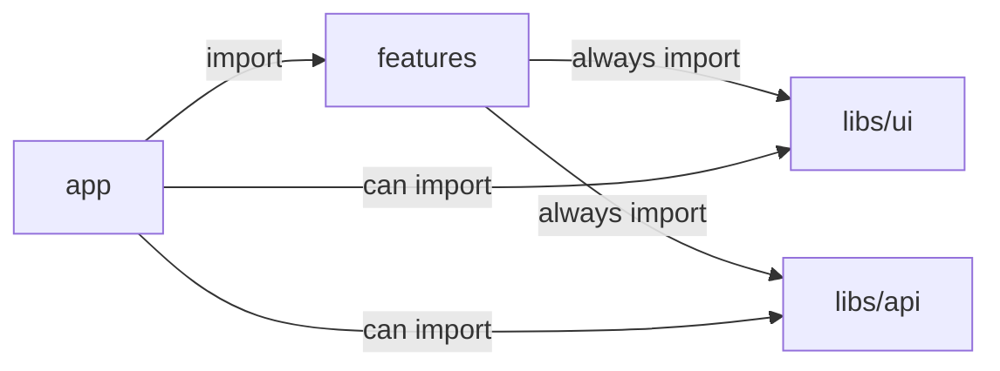

# Feature Garden Front-End Architecture

> This document is not quite ready

Feature Garden is an opinionated feature-based architecture for component-based front-end applications.

- [Problem](#problem)
- [Solution](#solution)
- [When to use](#when-to-use)
- [When not to use](#when-not-to-use)
- [Core Idea](#core-idea)
- [Example Project](#example-project)
- [API Library](#api-library)
- [UI Library](#ui-library)
- [Features](#features)
- [Shared features](#shared-features)
- [App](#app)
- [License](#license)

## Problem

One of the main problems in modern application development is controlling complexity as applications grow.
Existing approaches often optimize either for early development speed or for large-scale, but struggle to provide a clear growth path from zero to complexity.
Large-scale solutions often sacrifice simplicity (KISS) and pragmatism (YAGNI) in favor of strict rules and structure. A feature-based approach is a good starting point, but it does not enforce architectural boundaries and leaves many important questions unanswered.

## Solution
Feature Garden is an opinionated feature-based architecture inspired by components and nature.
It is designed to scale naturally from a single feature to a complex system, just like a garden grows from a small tree. Feature Garden is conducive to SoC, low coupling, high cohesion, KISS, DRY, YAGNI, and local reasoning.

## When to use

- Your product is expected to grow in scope and complexity
- You want a clear evolution path from MVP to large-scale systems
- You value feature isolation, low coupling, local reasoning, and strong developer experience
- You prefer simplicity and pragmatism over architectural purity

## When not to use

- The project is small and unlikely to grow
- The team is not ready to enforce architectural boundaries
- You prefer a strictly layered or heavily standardized enterprise architecture
- You need a framework-agnostic architecture with strong separation from UI technologies
- Your framework is not component-based

## Core Idea
Treat your framework as a foundation, not something to fight against.

The app has 3 layers:

- **libs** — low-level building blocks of the application.  
  Typically includes:
  - **UI library** (`Button`, `Input`, `ConfirmModal`)
  - **API library** (`useTasks`, `createTask`, `startTask`)

- **features** — user-facing capabilities composed from libs.  
  Features can be nested, forming a tree-like structure  
  (`tasks`, `active-task`, `time-intervals`).

- **app** — composes features into the final application and implements routing according to the chosen framework.

These layers follow the import rules shown below:

**Enforce these rules with ESLint or an equivalent tool.**

## Example Project

A full working example built using Feature Garden is available here:

https://github.com/Vladyslav-Murashchenko/productivity-up

The project demonstrates:
- Layer separation (`libs`, `features`, `app`)
- Strict import boundaries enforced with ESLint
- Nested feature composition
- Practical usage of shared feature
- Additional library `libs/animations`

It represents a small but complete application that can be used as a reference implementation.

## API Library

The goal of the API Library is to provide convenient abstractions for reading and updating data across the application. The idea is that the feature called `useTasks` should not care about:

- REST or GraphQL
- axios or fetch
- get data from cache or fetch from server
- cache invalidation
- backend or IndexedDB

The feature is just using abstraction, which is common and convenient in your framework, and it works.

This architecture does not impose strict rules on the API library's internal structure. The exact structure depends on the needs and complexity of your project.

One possible way to organize it could look like this:
```
libs/api/
├── _internal/
│   └── db.ts                     # Private implementation details
├── active-task/
│   ├── completeActiveTask.ts    
│   ├── model.ts                  # ActiveTaskState type
│   ├── pauseActiveTask.ts       
│   ├── startTask.ts             
│   └── useActiveTaskState.ts     
├── tasks/
│   ├── createTask.ts             
│   ├── deleteTask.ts             
│   ├── model.ts                  # Task type
│   ├── reopenTask.ts             
│   ├── useTask.ts               
│   ├── useTasks.ts               
│   └── updateTaskName.ts        
└── time-intervals/
    ├── createTimeInterval.ts    
    ├── deleteTimeInterval.ts    
    ├── model.ts                  # TimeInterval type
    ├── updateTimeInterval.ts   
    ├── useTaskDuration.ts       
    └── useTaskTimeIntervals.ts
```

## UI Library
The goal of the UI library is to provide a reusable abstraction for the application's appearance. The idea is that when the feature uses the `Button` component, it should not care about:

- Whether it is built from scratch or uses an external UI library
- How theming is implemented
- Unnecessary accessibility details
- Animation and interaction details
- How consistency with the design system is maintained

The feature is just using the component, and it works.

Abstractions inside the UI library must not know anything about your domain. For example, having `TaskModal` inside the UI library would be wrong, because the UI library shouldn't know that the app is about tasks.

You may choose not to have an internal UI library at all and use an external one. However, there are strong reasons to introduce an internal UI layer:

- The external libraries API is usually too generic, so in the internal library, you can make it simpler
- At some point, you may decide to switch to a different external UI library. Having an internal abstraction significantly reduces the migration cost

This architecture does not impose strict rules on the UI library's internal structure. The exact structure depends on the needs and complexity of your project.

One possible way to organize it could look like this:
```
libs/ui/
├── modal/
│   ├── ConfirmModal.tsx         # Confirmation dialog with cancel/confirm actions
│   ├── FormModal.tsx            # Modal with form submit functionality
│   └── Modal.tsx                
├── utils/
│   ├── cn.ts                    # ClassName utility
│   ├── formatDuration.ts        # Format milliseconds to "Xh Ym Zs" string
│   ├── showToast.ts             # Display toast notifications
│   └── withErrorToast.ts        # Generic error handling wrapper with toast
├── Button.tsx                    
├── ButtonGroup.tsx            
├── Card.tsx                     
├── DateTimePicker.tsx          
├── FieldError.tsx             
├── Input.tsx               
├── Label.tsx                   
├── Spinner.tsx                
├── TextField.tsx               
└── Toast.tsx                 
```

## Features

The goal of a feature is to compose UI and API into a cohesive unit of user-facing functionality.

In practice, a feature is a folder that contains modules (primarily components).

By default, all modules inside a feature are private. A module becomes public only if it is explicitly exported from the feature’s public entry point (index.ts).

Features may contain nested features.

Each feature is fully independent. Import rules enforce strict boundaries:

- A feature must not import sibling features (restricted via `../**`)
- A feature must not import from its parent feature (restricted via `../**`)
- A feature must not import private modules from its child features (restricted via `./*/**`)

**Enforce these rules with ESLint or an equivalent tool.**

Features do not contain technical subfolders such as `components`, `hooks`, or `utils`. Every folder inside a feature represents a nested feature, not a technical grouping.

If you feel the need to introduce folders like `components` or `utils`, it is likely a sign that:
- Some modules should be grouped into a nested feature, or
- The logic belongs to the `libs` layer.

**Tip:** Start with small features. They can be easily composed into larger ones later if needed.

Example:
```
features/
└── tasks/               # This app has only one root feature, this is fine
    ├── index.ts         # exports Tasks
    ├── Filters.tsx
    ├── TaskList.tsx     # imports Task
    ├── Tasks.tsx        # imports CreateTask, ActiveTask
    ├── Tasks.test.tsx
    ├── useTemporaryHiddenTaskId.ts
    ├── active-task/
    │   ├── index.ts     # exports ActiveTask
    │   ├── ActiveTask.tsx
    │   ├── ActiveTask.test.tsx
    │   ├── TaskName.tsx
    │   └── Timer.tsx
    ├── create-task/
    │   ├── index.ts     # exports CreateTask
    │   ├── CreateTask.tsx
    │   ├── CreateTask.test.tsx
    │   └── useAutoFocusOnDesktop.ts
    └── task/
        ├── index.ts     # exports Task
        ├── DeleteTask.tsx
        ├── Task.tsx
        ├── Task.test.tsx
        ├── TaskDuration.tsx           # imports TimeIntervalsModal
        ├── TaskName.tsx
        └── time-intervals/
            ├── index.ts               # exports TimeIntervalsModal
            ├── AddIntervalButton.tsx  # imports CreateInterval
            ├── TimeInterval.tsx       # imports EditInterval
            ├── TimeIntervals.tsx
            ├── TimeIntervalsModal.tsx
            ├── TimeIntervalsModal.test.tsx
            ├── sortIntervals.ts
            ├── sortIntervals.test.ts
            └── interval-forms/
                ├── index.ts           # exports CreateInterval, EditInterval
                ├── CreateInterval.tsx       # imports IntervalForm
                ├── CreateInterval.test.tsx
                ├── CreateInterval.utils.ts
                ├── CreateInterval.utils.test.ts
                ├── EditInterval.tsx         # imports IntervalForm
                ├── EditInterval.test.tsx
                └── interval-form/
                    ├── index.ts             # exports IntervalForm
                    ├── IntervalForm.tsx
                    ├── IntervalForm.test.tsx
                    ├── validateInterval.ts
                    └── validateInterval.test.ts
```

## Shared features

Sometimes a block of functionality - combining both UI and API - needs to be reused across multiple features. 
In such cases, it does not naturally belong to any single feature. And it cannot be in the library because it is already a composition.

This is the only valid reason to introduce a shared feature.

The `shared-features` folder is not a separate architectural layer. 
It still contains features and follows the same rules.

The only difference is that a feature can only be imported by its parent feature or by the `app` layer.
Shared features are an exception - they can be imported from any place by other features.

**Shared features are not the primary mechanism for structuring an application.**
They represent a deliberate trade-off, used only when avoiding duplication (DRY) is more important than preserving strict architectural isolation.

Example:
```
features/
└── tasks/           
    ├── ...
    ├── active-task/
    │   ├── ...
    │   └── TaskName.tsx      # imports EditTaskNameModal
    └── task/
        ├── ...
        └── TaskName.tsx      # imports EditTaskNameModal
shared-features/
└── edit-task-name/
    ├── index.ts              # exports EditTaskNameModal
    ├── EditTaskNameForm.tsx
    ├── EditTaskNameModal.tsx
    └── EditTaskNameModal.test.tsx
```

## App

The purpose of the App layer is to compose features into the final application.
Composition should follow the conventions and mechanisms provided by your framework.

## License

© 2026-present Vladyslav Murashchenko

Feature Garden is licensed under the Creative Commons Attribution 4.0 International License (CC BY 4.0).

You are free to use, modify, and distribute this work, including commercially. Just make sure to give credit to the original author.

See the LICENSE file for full details.


