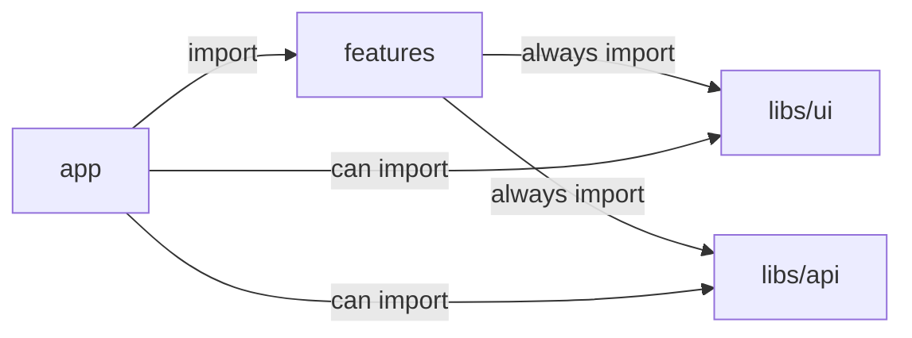

# Feature Garden Front-End Architecture

Feature Garden is an opinionated feature-based architecture for component-based front-end applications.

## Problem

One of the main problems in modern application development is controlling complexity as applications grow.
Existing approaches often optimize either for early development speed or for large-scale, but struggle to provide a clear growth path from zero to complexity.
Large-scale solutions often sacrifice simplicity (KISS) and pragmatism (YAGNI) in favor of strict rules and structure.

## Solution
Feature Garden is an opinionated feature-based architecture inspired by components and nature.
It is designed to scale naturally from a single feature to a complex system, just like a garden grows from a small tree. Feature Garden is conducive to SoC, low coupling, high cohesion, KISS, DRY, YAGNI, and Local Reasoning.

## When to use Feature Garden

- Your product is expected to grow in scope and complexity
- You want a clear evolution path from MVP to large-scale systems
- You value feature isolation, low coupling, local reasoning, and strong developer experience
- You prefer simplicity and pragmatism over architectural purity

## When not to use Feature Garden

- The project is small and unlikely to grow
- The team is not ready to enforce architectural boundaries
- You prefer a strictly layered or heavily standardized enterprise architecture
- You need a framework-agnostic architecture with strong separation from UI technologies
- Your framework is not component-based

## Core Idea
Treat your framework as a foundation, not something to fight against.

The app has 3 layers:

- `libs` - low-level building blocks of the app. A typical app has UI and API libraries (UI - Button, Input, ConfirmModal; API - useTasks, createTask, startTask)
- `features` - compose libs into business capabilities (tasks, active-task, time-intervals)
- `app` - composes features into the application and implements routing according to the framework

These layers follow the import rules shown below:

**Enforce these rules with ESLint or an equivalent tool.**

