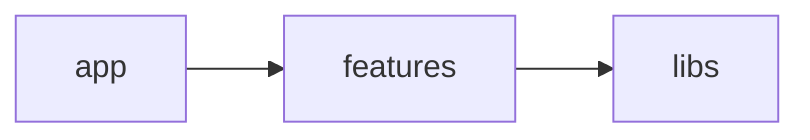
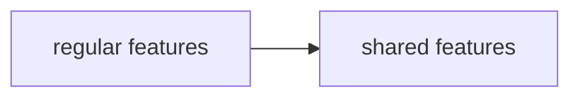

# Feature Garden Core

Feature Garden is an opinionated, tree-based, modular architectural methodology for structuring front-end applications.

- [Terminology](#terminology)
- [Goal](#goal)
- [Core Idea](#core-idea)
- [Feature Tree](#feature-tree)
- [Rules](#rules)

## Terminology

- **Architectural module** — an independent structural unit of the system that encapsulates functionality behind a public interface
- **Module** — an architectural module implemented as a single file
- **Feature** — an architectural module implemented as a folder that organizes modules and nested features
- **Library** — a collection of modules grouped around a single concern
- **External library** — package installed via a package manager like npm
- **Directed acyclic graph (DAG)** — a graph where modules are connected by directional dependencies, and following those dependencies can never lead back to the same module

## Goal

The goal of Feature Garden is to manage the application's structural complexity by controlling module visibility.

## Core Idea
The application consists of three layers:

- **Libraries** — provide reuse
- **Features** — define structure
- **App** — composes the application

### Libraries
Libraries provide reusable building blocks and are the primary mechanism for sharing code across features.

Each library represents a clear application concern, such as UI, API, or domain.

They encapsulate implementation details, such as external libraries, infrastructure-specific logic, or domain knowledge, hiding them from the rest of the application by acting as facades or adapters.

Libraries are typically independent and unaware of each other.
However, dependencies between libraries are allowed.

### Features

All folders at any depth inside the features layer are features. Technical folders like `ui`, `api`, or `model` are not allowed.

Features are the main mechanism for managing structural complexity.
They compose library modules into cohesive architectural modules.
Root-level features typically represent user-facing capabilities.
Modules inside a feature are private by default and become public only through the feature’s public entry point (`index.ts`).
Features can be nested, forming a [Feature Tree](#feature-tree) that helps manage complexity.

The features layer consists of two folders: `features` and `shared-features`.
The difference lies in how root-level features are used:

- Root-level features in `features` are used only by the app layer
- Root-level features in `shared-features` can be used by any feature

This enables reuse at the feature level.

Shared features are not the primary mechanism for structuring an application.
They represent a deliberate trade-off, used only when avoiding duplication (DRY) is more important than preserving strict architectural isolation.

### App
The App layer is responsible for composing features into the final application. Composition should follow the framework’s conventions and mechanisms.

This layer is also responsible for injecting application-wide dependencies, such as providers, configuration, adapters, stores, clients, and other global setups.

## Feature Tree

Dependencies form a directed graph. In a healthy codebase, this graph must not have cycles. Such a graph is a directed acyclic graph, or DAG.

A tree is a DAG with an additional constraint: each node can have only one parent.

This constraint dramatically limits complexity. A connected module dependency DAG with `n` modules can have from `n - 1` up to `O(n²)` dependency edges. A tree always has exactly `n - 1` edges, keeping relationships linear and predictable.

Can we make a DAG visible in the project folder structure? Not really. A folder structure is naturally a tree, while a DAG can contain arbitrary acyclic relationships.

Conveniently, UI composition is often tree-shaped: the DOM is a tree, and component-based UI is usually described as a tree of components.

What if we could simplify the dependency DAG into a tree and express it explicitly through the folder structure? This is the core idea of Feature Garden.

To make this work, Feature Garden enforces strict import rules inside a feature:

- Modules inside a feature must not import from the parent feature. Restrict `..**`.
- Modules inside a feature must not import private modules from nested features. Restrict `./*/**`.

This enables symmetric isolation:

- A nested feature does not know its location in the tree.
- A parent feature does not know its child features' internal structure.

This combination of symmetric isolation and explicit tree structure gives Feature Garden unique properties:

- **Local decomposition** — a growing feature can be split inward into nested features without exposing internal complexity to the rest of the app.
- **Scoped names** — nested feature names describe local responsibility instead of carrying their parent context as a prefix.
- **Simple promotion** — moving a nested feature to shared-features, or somewhere else, requires changing imports in only one place: its immediate parent.
- **Nesting is cheap** — depth does not make any import paths longer, so nested features avoid common deep nesting issues.

Unlike layer-based approaches like FSD, where isolation applies primarily between slices of the same layer, these properties hold recursively at every nesting level.

These advantages are powerful, but trees are not universal enough to represent the full dependency graph of a real application. Feature Garden’s trade-off is to use trees by default, and fall back to libraries and shared features when reuse requires a more general DAG.

## Rules
- Module dependencies must form a directed acyclic graph
- Layers must follow the dependency rules shown below

- The features layer contains both features and shared features and follows this dependency rule:

- Dependencies between libraries must be explicit
- Folders at any depth inside the features layer are features. Technical folders are not allowed.
- Modules inside a feature cannot import from the parent feature: `..**` is restricted.
- Modules inside a feature cannot import private modules from nested features: `./*/**` is restricted.
- All rules must be enforced by tooling (ESLint or equivalent)

## Read next

- [Engineering Guide](./engineering-guide.md) — learn how to apply Feature Garden in real projects.
