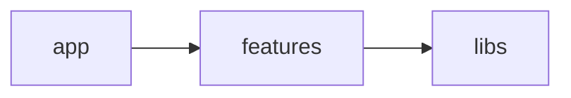
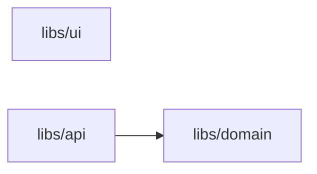
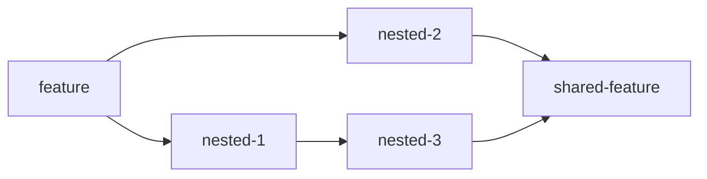
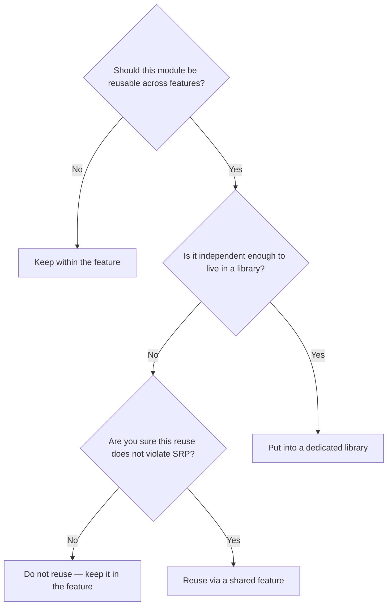

# Feature Garden Engineering Guide

> This section is in progress

This guide focuses on the practical side of Feature Garden.

It helps you make decisions across the entire lifecycle of a project — from the initial setup to long-term evolution:

- [How do you start a new project?](#how-do-you-start-a-new-project)
- [What libraries should you begin with?](#what-libraries-should-you-begin-with)
- [How do you split the UI into features?](#how-do-you-split-the-ui-into-features)
- [How do you reuse code?](#how-do-you-reuse-code)
- [How do you keep complexity under control as the system grows?](#how-do-you-keep-complexity-under-control-as-the-system-grows)
- [Where should this module live?](#where-should-this-module-live)


## How do you start a new project?

To start a new project, follow these steps:

1. Scaffold the project using a framework of your choice.  
   Most frameworks define how routing works and provide a dedicated folder for it — this becomes your **app layer**.

2. Create the following top-level folders:
   - `features`
   - `shared-features`
   - `libs`  
   Add `.gitkeep` files so Git tracks them.

3. Decide which libraries you want to include from the start.  
   See: [What libraries should you begin with?](#what-libraries-should-you-begin-with)  
   Then create corresponding folders inside `libs`.

4. Set up boundary enforcement early.  
   See: [Enforcement Guide](./enforcement-guide.md)

5. *(Optional)* Add a link to Feature Garden in your project’s `README.md`:  
   https://github.com/Vladyslav-Murashchenko/feature-garden

## What libraries should you begin with?

There is no universal answer to this question — it depends on your application, the framework you use, and the surrounding ecosystem.

However, in most cases, three libraries are a good starting point: `domain`, `api`, and `ui`.

### Domain Library

The goal of the domain library is to extract shared domain models and domain logic from features, centralize them, and make them reusable across the application.

This does not mean that all domain logic must live in the domain library. It is perfectly fine to keep domain logic inside a feature when it is specific to that feature and is not reused elsewhere.

The main property of the domain is that it is completely unaware of any infrastructure.
The domain should not depend on APIs, databases, or external services.
To achieve this, I prefer to model the domain as an anemic domain model, with all domain logic expressed as pure functions. This keeps the domain fully functional and easy to reason about.

Example from [productivity-up](https://github.com/Vladyslav-Murashchenko/productivity-up):
```
libs/domain/
    ├── model.ts
    └── time-intervals/
        ├── calculateDuration.ts
        ├── calculateDuration.test.ts
        ├── getInitial.ts
        ├── getInitial.test.ts
        ├── sortIntervals.ts
        ├── sortIntervals.test.ts
        ├── validateInterval.ts
        └── validateInterval.test.ts
```

However, you can also use a rich domain model if that better fits your preferences or constraints.

### API Library

The API library centralizes data access logic to avoid duplication across the application.
It exposes abstractions for reading and mutating data, shaped by the framework, data fetching and caching strategies, and the desired level of encapsulation.

For example, an abstraction can encapsulate details about:

- Whether data comes from cache or requires a server request
- How cache invalidation is implemented
- Whether Axios or the native Fetch API is used
- Whether the API uses REST, GraphQL, or tRPC

I recommend using [TanStack Query](https://tanstack.com/query/latest) or a similar solution that handles data fetching, mutations, caching, and request states.
This removes the need for most manual state management, meaning you may not need a dedicated state management library in your initial setup.

### UI Library
The goal of the UI library is to provide a reusable abstraction for the application's appearance. 
The idea is that when a feature uses the `Button` component, it should not care about:

- Whether it is built from scratch or uses an external UI library
- How theming is implemented
- Unnecessary accessibility details
- Animation and interaction details
- How consistency with the design system is maintained

Abstractions inside the UI library must not know anything about your domain. For example, having `TaskModal` inside the UI library would be wrong, because the UI library shouldn't know that the app is about tasks.

You may choose not to have an internal UI library at all and use an external one. However, there are strong reasons to introduce an internal UI library:

- The external libraries API is usually too generic, so in the internal library, you can make it simpler
- At some point, you may decide to switch to a different external UI library. Having an internal abstraction significantly reduces the migration cost

Example from [productivity-up](https://github.com/Vladyslav-Murashchenko/productivity-up):
```
libs/ui/
├── modal/
│   ├── ConfirmModal.tsx         # Confirmation dialog with cancel/confirm actions
│   ├── FormModal.tsx            # Modal with form submit functionality
│   └── Modal.tsx                
├── utils/
│   ├── cn.ts                    # ClassName utility
│   ├── formatDuration.ts        # Format milliseconds to "Xh Ym Zs" string
│   └── showToast.ts             # Display toast notifications
├── Button.tsx                    
├── ButtonGroup.tsx            
├── Card.tsx                     
├── DateTimePicker.tsx          
├── FieldError.tsx             
├── Input.tsx               
├── Label.tsx                   
├── Spinner.tsx                
├── TextField.tsx               
└── Toast.tsx                 
```

## How do you split the UI into features?

Imagine the design looks like this

```
Screen 1: Dashboard
┌──────────────────────────────────────────────────────────────┐
│ Header                                                       │
├───────────────┬──────────────────────────────────────────────┤
│ Sidebar       │ Main content                                 │
│               │                                              │
│ - Dashboard   │ ┌──────────────────────────────────────────┐ │
│ - Reports     │ │ Dashboard Summary                        │ │
│               │ │                                          │ │
│               │ │ Total users: 1,240                       │ │
│               │ │ Active projects: 18                      │ │
│               │ │ Pending tasks: 7                         │ │
│               │ └──────────────────────────────────────────┘ │
│               │                                              │
└───────────────┴──────────────────────────────────────────────┘
Screen 2: Reports
┌──────────────────────────────────────────────────────────────┐
│ Header                                                       │
├───────────────┬──────────────────────────────────────────────┤
│ Sidebar       │ Main content                                 │
│               │                                              │
│ - Dashboard   │ ┌──────────────────────────────────────────┐ │
│ - Reports     │ │ Monthly Report                           │ │
│               │ │                                          │ │
│               │ │ Revenue: $24,500                         │ │
│               │ │ Conversion rate: 8.4%                    │ │
│               │ │ New customers: 312                       │ │
│               │ └──────────────────────────────────────────┘ │
│               │                                              │
└───────────────┴──────────────────────────────────────────────┘
```

In this case, the root-level features are:

- AppHeader - shared header
- AppSidebar - shared sidebar
- Dashboard - the Dashboard screen main content
- Reports - the Reports screen main content

Note that you don’t need shared features here, as the App layer is responsible for composing these features into final screens.

Large features are not a problem — they can be decomposed into nested features on demand, keeping the top-level structure stable.

## How do you reuse code?

If a module needs to be reused across different features, the primary mechanism is libraries.

UI, API, and Domain libraries cover common reuse scenarios. As your application evolves, you may introduce additional libraries to address more specific use cases.
Each library should be focused on a single concern of the system. Avoid generic libraries like utils, helpers, components, or hooks, as they tend to accumulate unrelated responsibilities over time.

In cases where code cannot be placed in a library because it already depends on multiple libraries (for example, a combination of UI and API), it can be reused through shared features.

However, overusing shared features can lead to complex and fragile dependency structures. Before extracting code into a shared feature, make sure this reuse does not violate the Single Responsibility Principle:

> A module should have one, and only one, reason to change — that is, one actor.

## How do you keep complexity under control as the system grows?

There are different types of complexity in applications. Feature Garden is primarily a tool for managing structural complexity.

In a Feature Garden architecture, structural complexity grows along several dimensions:

- The number of root-level features
- The number of modules within a feature
- The number of modules within libraries
- The number and direction of dependencies between modules

### The number of root-level features
In Feature Garden, root-level features cannot import one another, so adding a new root-level feature usually doesn't affect other features.
This type of complexity is handled naturally by the feature-based approach.

### The number of modules within a feature
This is where Feature Garden truly shines.

All modules within a feature are kept directly in the feature folder, without additional segmentation.
Most of these modules are components, and components naturally form hierarchies.
As the number of modules grows, related components and their supporting modules can be grouped into a nested feature.
This process can be applied recursively as many times as needed.

Typically, a nested feature exposes a single public component, though exceptions are possible.

Example from [productivity-up](https://github.com/Vladyslav-Murashchenko/productivity-up):
```
features/
└── tasks/               # This app has only one root feature, this is fine
    ├── index.ts         # exports Tasks
    ├── Filters.tsx
    ├── TaskList.tsx     # imports Task
    ├── Tasks.tsx        # imports CreateTask, ActiveTask
    ├── Tasks.test.tsx
    ├── useTemporaryHiddenTaskId.ts
    ├── active-task/
    │   ├── index.ts     # exports ActiveTask
    │   ├── ActiveTask.tsx
    │   ├── ActiveTask.test.tsx
    │   ├── TaskName.tsx
    │   └── Timer.tsx
    ├── create-task/
    │   ├── index.ts     # exports CreateTask
    │   ├── CreateTask.tsx
    │   ├── CreateTask.test.tsx
    │   └── useAutoFocusOnDesktop.ts
    └── task/
        ├── index.ts     # exports Task
        ├── DeleteTask.tsx
        ├── Task.tsx
        ├── Task.test.tsx
        ├── TaskDuration.tsx           # imports TimeIntervalsModal
        ├── TaskName.tsx
        └── time-intervals/
            ├── index.ts               # exports TimeIntervalsModal
            ├── AddIntervalButton.tsx  # imports CreateInterval
            ├── TimeInterval.tsx       # imports EditInterval
            ├── TimeIntervals.tsx
            ├── TimeIntervalsModal.tsx
            ├── TimeIntervalsModal.test.tsx
            ├── sortIntervals.ts
            ├── sortIntervals.test.ts
            └── interval-forms/
                ├── index.ts           # exports CreateInterval, EditInterval
                ├── CreateInterval.tsx       # imports IntervalForm
                ├── CreateInterval.test.tsx
                ├── EditInterval.tsx         # imports IntervalForm
                ├── EditInterval.test.tsx
                └── interval-form/
                    ├── index.ts             # exports IntervalForm
                    ├── IntervalForm.tsx
                    ├── IntervalForm.test.tsx
                    ├── validateInterval.ts
                    └── validateInterval.test.ts
```

### The number of modules within libraries
To prevent libraries from becoming messy and hard to navigate, split them into vertical slices.
Each slice should have a clear responsibility. A common heuristic is to align slices with domain entities or use cases.

Note that slices do not need to be consistent across different libraries — each library should use a slicing strategy that best fits its purpose.

### The number and direction of dependencies between modules
Strictly defined dependency directions constrain the number of possible dependencies.
In Feature Garden, dependencies always flow in a single direction.

**Figure 1. Dependency directions between layers:**


**Figure 2. Dependency directions between core libraries:**


**Figure 3. Example dependency directions within features:**


By constraining the direction of dependencies, Feature Garden limits the growth of structural complexity.

## Where should this module live?

Use the decision tree below to decide where a module should live.

**Figure 4. Module placement decision flow**



TODO:
- Migration guide
- Decision guide
  - When to create a feature
  - When to create a nested function
  - When to leave a plain file
  - When to move to libs
  - When is shared-feature allowed
  - When should NOT be shared-feature
  - How do I know that a function has become too big
  - How do I know that a library has become a garbage can
