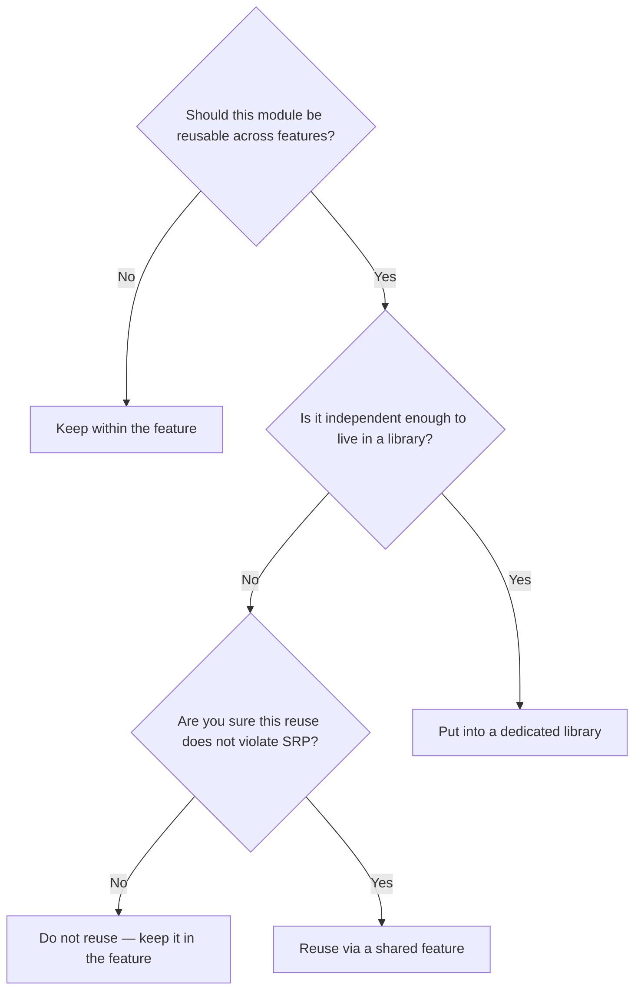
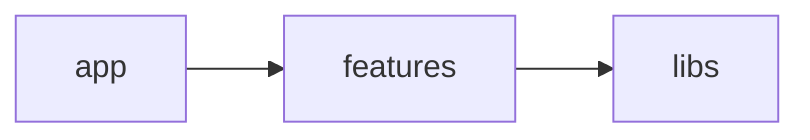
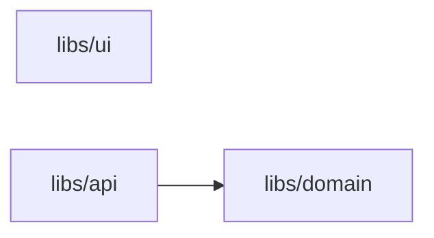
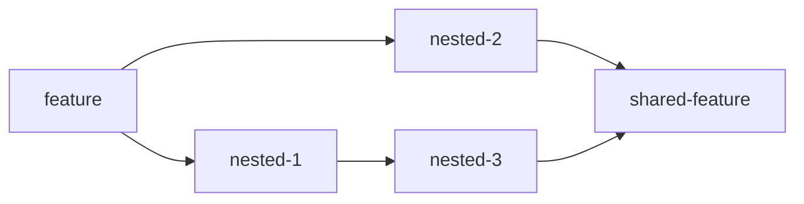

# Feature Garden Engineering Guide

This guide focuses on the practical side of Feature Garden.

It helps you make decisions across the entire lifecycle of a project — from the initial setup to long-term evolution:

- [How to start a new project?](#how-to-start-a-new-project)
- [What libraries to start with?](#what-libraries-to-start-with)
- [How to split the UI into features?](#how-to-split-the-ui-into-features)
- [Where should this module live?](#where-should-this-module-live)
- [How to reuse code?](#how-to-reuse-code)
- [When to create a shared feature?](#when-to-create-a-shared-feature)
- [How to keep complexity under control as the system grows?](#how-to-keep-complexity-under-control-as-the-system-grows)
- [When and how to create a nested feature?](#when-and-how-to-create-a-nested-feature)
- [How to manage state?](#how-to-manage-state)
- [How to test the codebase?](#how-to-test-the-codebase)
- [How to migrate an existing codebase?](#how-to-migrate-an-existing-codebase)
- [How to scale development teams?](#how-to-scale-development-teams)
- [How to use with microfrontends?](#how-to-use-with-microfrontends)
- [Read next](#read-next)
   - [AI Assisted Coding Guide](./ai-assisted-coding-guide.md)

## How to start a new project?

To start a new project, follow these steps:

1. Scaffold the project using a framework of your choice.  
   Most frameworks define how routing works and provide a dedicated folder for it — this becomes your **app layer**.

2. Create the following top-level folders:
   - `features`
   - `shared-features`
   - `libs`  
   Add `.gitkeep` files so Git tracks them.

3. Decide which libraries you want to include from the start.  
   See: [What libraries to start with?](#what-libraries-to-start-with)  
   Then create corresponding folders inside `libs`.

4. Set up boundary enforcement early.  
   See: [Enforcement Guide](./enforcement-guide.md)

5. *(Optional)* Add a link to Feature Garden in your project’s `README.md`:  
   https://github.com/Vladyslav-Murashchenko/feature-garden

## What libraries to start with?

There is no universal answer to this question — it depends on your application, the framework you use, and the surrounding ecosystem.

However, in most cases, three libraries are a good starting point: `domain`, `api`, and `ui`.

### Domain Library

The goal of the domain library is to extract shared domain models and domain logic from features, centralize them, and make them reusable across the application.

This does not mean that all domain logic must live in the domain library. It is perfectly fine to keep domain logic inside a feature when it is specific to that feature and is not reused elsewhere.

The main property of the domain is that it is completely unaware of any infrastructure.
The domain should not depend on APIs, databases, or external services.
To achieve this, I prefer to model the domain as an anemic domain model, with all domain logic expressed as pure functions. This keeps the domain fully functional and easy to reason about.

Example from [productivity-up](https://github.com/Vladyslav-Murashchenko/productivity-up):
```
libs/domain/
    ├── model.ts
    └── time-intervals/
        ├── activeTaskInterval.ts
        ├── activeTaskInterval.test.ts
        ├── initialInterval.ts
        ├── initialInterval.test.ts
        ├── timeIntervals.ts
        ├── timeIntervals.test.ts
        ├── validateInterval.ts
        └── validateInterval.test.ts
```

However, you can also use a rich domain model if that better fits your preferences or constraints.

### API Library

The API library centralizes data access logic to avoid duplication across the application.
It exposes abstractions for reading and mutating data, shaped by the framework, data fetching and caching strategies, and the desired level of encapsulation.

For example, an abstraction can encapsulate details about:

- Whether data comes from cache or requires a server request
- How cache invalidation is implemented
- Whether Axios or the native Fetch API is used
- Whether the API uses REST, GraphQL, or tRPC

I recommend using [TanStack Query](https://tanstack.com/query/latest) or a similar solution that handles data fetching, mutations, caching, and request states.
This removes the need for most manual state management, meaning you may not need a dedicated state management library in your initial setup.

### UI Library
The goal of the UI library is to provide a reusable abstraction for the application's appearance. 
The idea is that when a feature uses the `Button` component, it should not care about:

- Whether it is built from scratch or uses an external UI library
- How theming is implemented
- Unnecessary accessibility details
- Animation and interaction details
- How consistency with the design system is maintained

Abstractions inside the UI library must not know anything about your domain. For example, having `TaskModal` inside the UI library would be wrong, because the UI library shouldn't know that the app is about tasks.

You may choose not to have an internal UI library at all and use an external one. However, there are strong reasons to introduce an internal UI library:

- External UI libraries do not eliminate repetition — common UI patterns still emerge. An internal UI library provides a place to reuse them
- The external libraries API is usually too generic, so in the internal library, you can make it simpler
- At some point, you may decide to switch to a different external UI library. Having an internal abstraction significantly reduces the migration cost

Example from [productivity-up](https://github.com/Vladyslav-Murashchenko/productivity-up):
```
libs/ui/
├── modal/
│   ├── ConfirmModal.tsx         # Confirmation dialog with cancel/confirm actions
│   ├── FormModal.tsx            # Modal with form submit functionality
│   └── Modal.tsx                
├── utils/
│   ├── cn.ts                    # ClassName utility
│   ├── formatDuration.ts        # Format milliseconds to "Xh Ym Zs" string
│   └── showToast.ts             # Display toast notifications
├── Button.tsx                    
├── ButtonGroup.tsx            
├── Card.tsx                     
├── DateTimePicker.tsx          
├── FieldError.tsx             
├── Input.tsx               
├── Label.tsx                   
├── Spinner.tsx                
├── TextField.tsx               
└── Toast.tsx                 
```

## How to split the UI into features?

Imagine a design like this:

```
Screen 1: Dashboard
┌──────────────────────────────────────────────────────────────┐
│ Header                                                       │
├───────────────┬──────────────────────────────────────────────┤
│ Sidebar       │ Main content                                 │
│               │                                              │
│ - Dashboard   │ ┌──────────────────────────────────────────┐ │
│ - Reports     │ │ Dashboard Summary                        │ │
│               │ │                                          │ │
│               │ │ Total users: 1,240                       │ │
│               │ │ Active projects: 18                      │ │
│               │ │ Pending tasks: 7                         │ │
│               │ └──────────────────────────────────────────┘ │
│               │                                              │
└───────────────┴──────────────────────────────────────────────┘
Screen 2: Reports
┌──────────────────────────────────────────────────────────────┐
│ Header                                                       │
├───────────────┬──────────────────────────────────────────────┤
│ Sidebar       │ Main content                                 │
│               │                                              │
│ - Dashboard   │ ┌──────────────────────────────────────────┐ │
│ - Reports     │ │ Monthly Report                           │ │
│               │ │                                          │ │
│               │ │ Revenue: $24,500                         │ │
│               │ │ Conversion rate: 8.4%                    │ │
│               │ │ New customers: 312                       │ │
│               │ └──────────────────────────────────────────┘ │
│               │                                              │
└───────────────┴──────────────────────────────────────────────┘
```

In this case, the root-level features are:

- AppHeader - shared header
- AppSidebar - shared sidebar
- Dashboard - the Dashboard screen main content
- Reports - the Reports screen main content

Note that you don’t need shared features here, as the App layer is responsible for composing these features into final screens.

Large features are not a problem — they can be decomposed into nested features on demand, keeping the top-level structure stable.

## Where should this module live?

Use the decision tree below to decide where a module should live.

**Figure 1. Module placement decision flow**


## How to reuse code?

If a module needs to be reused across different features, the primary mechanism is libraries.

UI, API, and Domain libraries cover common reuse scenarios. As your application evolves, you may introduce additional libraries to address more specific use cases.
Each library should be focused on a single concern of the system. Avoid generic libraries like utils, helpers, components, or hooks, as they tend to accumulate unrelated responsibilities over time.

In cases where code cannot be placed in a library because it already depends on multiple libraries (for example, a combination of UI and API), it can be reused through shared features.

However, overusing shared features can lead to complex and fragile dependency structures. Before extracting code into a shared feature, read the next chapter.

## When to create a shared feature?

Two software engineering principles are not always easy to use together: DRY and SRP.

DRY:
> Every piece of knowledge must have a single, unambiguous, authoritative representation within a system.

SRP:
> A module should have one, and only one, reason to change — that is, one actor.

The problem is that it is hard to distinguish a piece of knowledge from a coincidentally repeated code pattern.
If you accidentally hide a coincidentally repeated code pattern behind a module, that module will likely violate SRP.

In Feature Garden, a good reuse heuristic is to ask whether the module belongs to a dedicated library.

If it does, the module likely represents reusable knowledge and can be extracted into that library.

If it does not, the module probably acts as a composition layer over other libraries. Reusing composition modules is risky because they often have multiple reasons to change.

But if you are sure that this reuse doesn't violate SRP, Feature Garden provides shared features.

Let's look at examples when shared features can be justified.

Example from [productivity-up](https://github.com/Vladyslav-Murashchenko/productivity-up):
```
features/
└── tasks/           
    ├── ...
    ├── active-task/
    │   ├── ...
    │   └── TaskName.tsx      # imports EditTaskNameModal
    └── task/
        ├── ...
        └── TaskName.tsx      # imports EditTaskNameModal
shared-features/
└── edit-task-name/
    ├── index.ts              # exports EditTaskNameModal
    ├── EditTaskNameForm.tsx
    ├── EditTaskNameModal.tsx
    └── EditTaskNameModal.test.tsx
```
In this example, `edit-task-name` is the same modal that opens when the user clicks on a task name.

Note that `active-task` and `task` use different `TaskName` components because the name behaves differently in each place. In `active-task`, the name is truncated. In `task`, the full name is always displayed. If the name takes several lines, the task card itself becomes taller.

This means that you stay in control of where to apply DRY and where to keep duplication intentionally.

In this particular case, the shared feature could also be avoided by moving `edit-task-name` higher in the component tree, above both components. However, this would force me to lift the state up or introduce a global state solution.

Another example from [productivity-up](https://github.com/Vladyslav-Murashchenko/productivity-up):
```
features/
└── tasks/
    ├── ...
    ├── active-task/
    │   ├── ...
    │   └── time-intervals/
    │       ├── ...
    │       ├── ActiveTimeInterval.tsx # imports TimeIntervalCard
    │       └── TimeIntervals.tsx      # imports TimeIntervalCard
    └── task/
        ├── ...
        └── time-intervals/
            ├── ...
            └── TimeInterval.tsx       # imports TimeIntervalCard
shared-features/
└── time-interval/
    ├── index.ts                       # exports TimeIntervalCard
    └── TimeIntervalCard.tsx
```
Both `task` and `active-task` have local nested features named `time-intervals`.

At the UI, these `time-intervals` features look very similar. However, they have very different behaviors. Inside `task`, `time-intervals` provides full CRUD functionality. Inside `active-task`, `time-intervals` are read-only, and an additional active time interval is displayed.

If `time-intervals` were extracted into a shared feature, it would definitely violate SRP. Instead, the shared feature is `time-interval`, which is responsible only for displaying the card component.

This way, the card component can be changed in one place, while the risk of violating SRP is much smaller than with reusing the whole `time-intervals` feature. If at some point `TimeIntervalCard` becomes too different across views, the shared feature can be replaced with a unique implementation inside each feature.

Important that it is not necessary to create a shared feature if you need to reuse something in the scope of a feature.
Look at the example:

```
features/
└── tasks/
    ├── ...
    └── task/
        ├── ...
        └── time-intervals/
            ├── ...
            └── interval-forms/
                ├── index.ts           # exports CreateInterval, EditInterval
                ├── CreateInterval.tsx       # imports IntervalForm
                ├── CreateInterval.test.tsx
                ├── EditInterval.tsx         # imports IntervalForm
                ├── EditInterval.test.tsx
                └── interval-form/
                    ├── index.ts             # exports IntervalForm
                    ├── IntervalForm.tsx
                    ├── IntervalForm.test.tsx
                    ├── validateInterval.ts
                    └── validateInterval.test.ts
```
In the example, both `CreateInterval` and `EditInterval` use the `interval-form` feature.

If these two components were extracted into separate nested features, this reuse would require a shared feature. However, this separation is unlikely to be useful, because both components are just variants of `IntervalForm`.

This is another reason why I recommend postponing nested feature extraction until there are at least 5 modules inside a feature.

## How to keep complexity under control as the system grows?

There are different types of complexity in applications. Feature Garden is primarily a tool for managing structural complexity.

In a Feature Garden architecture, structural complexity grows along several dimensions:

- The number of root-level features
- The number of modules within a feature
- The number of modules within libraries
- The number and direction of dependencies between modules

### The number of root-level features
In Feature Garden, root-level features cannot import one another, so adding a new root-level feature usually doesn't affect other features.
This type of complexity is handled naturally by the feature-based approach.

### The number of modules within a feature

Feature Garden provides two options for managing the number of modules inside a feature.

The first option is to move a module into a library. This is useful when the module should be reusable or has a clear responsibility that already belongs to one of the libraries. For example, domain logic can be moved to the domain library to simplify the feature.

The second option is to decompose the feature into nested features. Nested features are independent from each other. Everything inside a nested feature is private by default, and the parent feature can access only its public entry point.

Read more about when and how to create a nested feature [in this chapter](#when-and-how-to-create-a-nested-feature).

### The number of modules within libraries
To prevent libraries from becoming messy and hard to navigate, split them into vertical slices.
Each slice should have a clear responsibility. A common heuristic is to align slices with domain entities or use cases.

Note that slices do not need to be consistent across different libraries — each library should use a slicing strategy that best fits its purpose.

### The number and direction of dependencies between modules
Strictly defined dependency directions constrain the number of possible dependencies.
In Feature Garden, dependencies always flow in a single direction.

**Figure 2. Dependency directions between layers:**


**Figure 3. Dependency directions between core libraries:**


**Figure 4. Example dependency directions within features:**


By constraining the direction of dependencies, Feature Garden limits the growth of structural complexity.
For this to work, dependency directions must be strictly enforced. See the [Enforcement Guide](./enforcement-guide.md).

## When and how to create a nested feature?

To keep features easy to decompose, keep all modules within a feature directly in the feature folder, without additional segmentation.

I do not recommend mixing new functionality with nested feature extraction. Commit your new functionality first.

Then look at the number of modules inside the feature folder. If it becomes hard to predict module dependencies, consider creating a nested feature.

This usually happens when a feature has more than 5 modules. Choose the number that works best for your team.

When counting modules, treat all technical files that belong to the same module as one module. For example, treat all the files below as one module:
```
Tasks.tsx
Tasks.test.tsx
Tasks.module.css
```

Try to find a group of modules that can be hidden inside a folder and exposed through a small public API. Ideally, a nested feature should expose only one module.

A nested feature should include at least 2 modules. Avoid extracting too many modules as well. Try to extract modules in a way that leaves the parent feature with 2–5 modules.

However, clear intent is more important than the exact number of extracted modules. A good heuristic is naming: if the nested feature can have an obvious, concise, and clear name, it probably has a clear responsibility.

Example from [productivity-up](https://github.com/Vladyslav-Murashchenko/productivity-up):
```
features/
└── tasks/               # This app has only one root feature, this is fine
    ├── index.ts         # exports Tasks
    ├── Filters.tsx
    ├── TaskList.tsx     # imports Task
    ├── Tasks.tsx        # imports CreateTask, ActiveTask
    ├── Tasks.test.tsx
    ├── useTemporaryHiddenTaskId.ts
    ├── active-task/
    │   ├── index.ts     # exports ActiveTask
    │   ├── ActiveTask.tsx
    │   ├── ActiveTask.test.tsx
    │   ├── TaskName.tsx
    │   └── Timer.tsx
    ├── create-task/
    │   ├── index.ts     # exports CreateTask
    │   ├── CreateTask.tsx
    │   ├── CreateTask.test.tsx
    │   └── useAutoFocusOnDesktop.ts
    └── task/
        ├── index.ts     # exports Task
        ├── DeleteTask.tsx
        ├── Task.tsx
        ├── Task.test.tsx
        ├── TaskDuration.tsx           # imports TimeIntervalsModal
        ├── TaskName.tsx
        └── time-intervals/
            ├── index.ts               # exports TimeIntervalsModal
            ├── AddIntervalButton.tsx  # imports CreateInterval
            ├── TimeInterval.tsx       # imports EditInterval
            ├── TimeIntervals.tsx
            ├── TimeIntervalsModal.tsx
            ├── TimeIntervalsModal.test.tsx
            ├── sortIntervals.ts
            ├── sortIntervals.test.ts
            └── interval-forms/
                ├── index.ts           # exports CreateInterval, EditInterval
                ├── CreateInterval.tsx       # imports IntervalForm
                ├── CreateInterval.test.tsx
                ├── EditInterval.tsx         # imports IntervalForm
                ├── EditInterval.test.tsx
                └── interval-form/
                    ├── index.ts             # exports IntervalForm
                    ├── IntervalForm.tsx
                    ├── IntervalForm.test.tsx
                    ├── validateInterval.ts
                    └── validateInterval.test.ts
```

In the example above, both `interval-forms` and `interval-form` contain only 2 modules. This suggests that `interval-form` may not be necessary yet. Avoid creating nested features too early. As the feature grows, a better extraction point may be discovered.

## How to manage state?

Client-side state can be roughly divided into three categories:

### Server state

Data that comes from the server.

- Managed in `libs/api`
- Includes fetching, caching, synchronization, and optimistic updates
- Typically handled with tools like [TanStack Query](https://tanstack.com/query/latest)

### URL state

State that is reflected in the URL.

- Managed by the router
- Shareable and bookmarkable
- Represents navigation and filtering

### UI state

All other states that are related to the user interface.

- Kept local to components by default
- Passed through explicit props when needed
- Extracted into a library only when local state and props become too cumbersome
- Includes things like modals, selections, and form state

Avoid feature-level global state abstractions. They introduce implicit dependencies between modules within a feature, making future decomposition into nested features harder. If a shared abstraction is needed, extract it into a dedicated `store` library instead.

If state management logic becomes complex and encodes domain rules, it should be decoupled from infrastructure and implemented as pure functions in the domain library.

## How to test the codebase?

In general, I recommend colocating test files with the modules they test.

The domain library should be easy to test with unit tests, especially if it is implemented as a functional core (composed of pure functions).

For features, use component testing (e.g., with [Testing Library](https://testing-library.com/)) to verify user behavior.  
API interactions can be mocked either at the library level or via a mock server (e.g., with [MSW](https://mswjs.io/)).
Mocking the API library is often simpler, but using a mock server provides more realistic coverage by testing the API library as well.

## How to migrate an existing codebase?

If you want to adopt Feature Garden in an existing project, avoid rewriting features upfront.

Instead, start by building new features using Feature Garden and gradually pull existing code into it.
To initialize Feature Garden, follow [these steps](#how-to-start-a-new-project).

Enforce an additional strict boundary: Feature Garden features and libraries must not import anything from the legacy codebase.
At the same time, legacy code is allowed to import from Feature Garden.

This constraint naturally forces reusable logic to move into Feature Garden libraries, enabling new features to be built on top of it.

When a legacy feature requires a major update, reimplement it inside the new features folder.
Do not worry about size — even small legacy features can be reimplemented directly at the root level of the features directory.
The root-level features can be imported from the legacy codebase.

Over time, smaller top-level features can be reorganized into larger ones as nested features.

## How to scale development teams?

One of the key advantages of Feature Garden is that it scales well from a single developer to multiple teams.

Feature Garden organizes the application into low-coupling features, allowing developers to work on different features in parallel.
Typically, root-level features are owned by a specific developer or team.
It is also common to have a dedicated team responsible for the UI library.

To enable fast integration and avoid blocking each other’s releases, I recommend using Trunk-Based Development together with feature flags.

With this setup, even a single codebase can support a high degree of team autonomy and allow many developers to work effectively in parallel.

As the system grows further, some teams may start to experience additional constraints:

- Coordinating releases across teams becomes more involved
- The cost of a single deployment (build time, risk) increases
- Stronger isolation between teams becomes desirable

Not every team will run into these challenges, and in many cases, they can be managed within a single codebase.

However, when they become significant, teams may introduce additional layers of isolation — such as microfrontends — on top of the existing architecture.

## How to use with microfrontends?

Feature Garden works naturally with microfrontends.

Microfrontends provide deployment and runtime isolation, while Feature Garden controls complexity within each microfrontend.

Because Feature Garden establishes clear boundaries between root-level features, those features can serve as natural candidates when introducing microfrontends.

In an existing microfrontend architecture, the simplest way to get started is to adopt Feature Garden within individual microfrontends.

## Read next

- [AI Assisted Coding Guide](./ai-assisted-coding-guide.md) — use AI as a force multiplier without losing control over structure.


